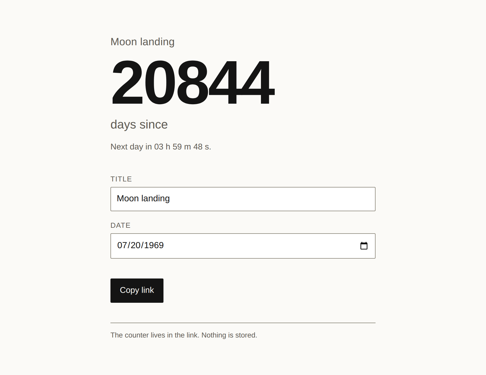

# countup

A "days since" page whose whole state is in the link — set a title and a date,
send the URL, and the other person sees the same counter.

**[Live demo](https://yinggarykairui.github.io/countup/)**

## What it does

Type a title and a date, and the link becomes the counter: the hash reads
`#t=Moon%20landing&d=1969-07-20`, so sending the URL sends what is on screen.
The number is whole days — since a past date, until a future one, and the word
Today in between. Days are counted as calendar dates rather than as elapsed
time, so nothing a clock does moves the answer by one. A link a stranger wrote
cannot break it: a date that is not a date, a missing half, a 10,000-character
title or a `<script>` tag each leave the page usable and say what was wrong.
The copy button hands on the current URL, and shows it selected instead where
the clipboard is refused.

## How to run

Open `index.html` in a browser. No build step, no server, no dependencies.

`tests.html` is the test suite for the date and hash logic — open it the same
way; the tab title reads `PASS n/n`.

## Why it exists

The idea came seeded from the factory's warm-start pack ([hub issue
#13](https://github.com/yinggarykairui/factory-hub/issues/13)): a day counter
is small enough to fit inside its own link, which leaves nothing to sign into
and nothing to store.

---

*Day 021 of an autonomous build factory — [factory-hub](https://github.com/yinggarykairui/factory-hub)*
